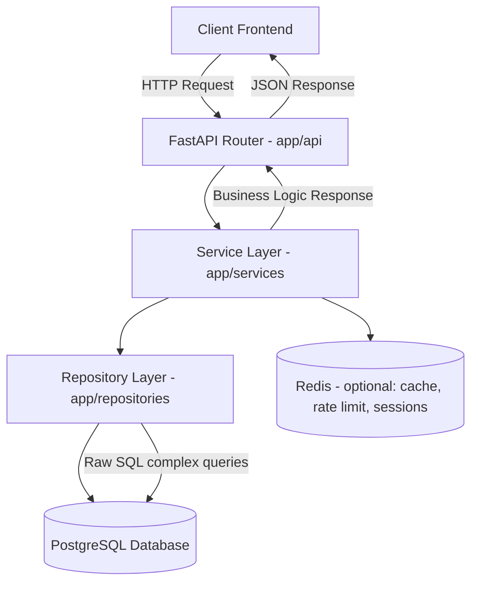

# AURA (Atams Universal Runtime Architecture)

[](https://fastapi.tiangolo.com/)
[](https://www.postgresql.org/)
[](https://redis.io/)
[](https://docs.docker.com/compose/)

A **backend template** for Atams projects built with **FastAPI**, **PostgreSQL**, and **Clean Architecture** principles.  
Lightweight, production-ready, and easy to extend.

---

## 📑 Table of Contents
- [Quick Start](#-quick-start)
  - [Setup with Docker](#setup-with-docker)
  - [Manual Setup (Development)](#manual-setup-development)
- [API Documentation](#-api-documentation)
- [Configuration](#-configuration)
- [Project Structure](#-project-structure)
- [Request Flow](#-request-flow-architecture-overview)
- [Testing](#-testing)
- [Deployment](#-deployment)
- [Notes](#-notes)
- [Contributing](#-contributing)

---

## 🚀 Quick Start

### Prerequisites
- Python **3.11+**
- PostgreSQL **15+**
- Redis (optional)
- Docker & Docker Compose (optional)

---

### Setup with Docker

1. Clone repository
```bash
git clone https://github.com/GratiaManullang03/aura.git
cd aura
````

2. Copy environment variables

```bash
cp .env.example .env
# Edit .env as needed
```

3. Run with Docker Compose

```bash
docker-compose up --build
```

👉 API will be available at **[http://localhost:8000](http://localhost:8000)**

---

### Manual Setup (Development)

1. Create a virtual environment

```bash
python -m venv venv
source venv/bin/activate  # Linux/Mac
venv\Scripts\activate     # Windows
```

2. Install dependencies

```bash
pip install -r requirements.txt
```

3. Setup PostgreSQL

```sql
CREATE DATABASE atabot;
CREATE SCHEMA IF NOT EXISTS atabot;

CREATE TABLE atabot."user" (
    u_id bigserial NOT NULL,
    u_name varchar NULL,
    u_created_at timestamp DEFAULT now() NOT NULL,
    u_updated_at timestamp NULL,
    CONSTRAINT user_pk PRIMARY KEY (u_id)
);
```

4. Run the app

```bash
uvicorn app.main:app --reload --port 8000
```

---

## 📚 API Documentation

* Swagger UI → [http://localhost:8000/docs](http://localhost:8000/docs)
* ReDoc → [http://localhost:8000/redoc](http://localhost:8000/redoc)

---

## 🔧 Configuration

### Authentication

* JWT-based authentication (skeleton implementation).
* Customize per client:

  * Token logic → `app/core/security.py`
  * Validation → `app/api/deps.py`
* Extend with **SSO, OAuth2, or API Key**.

### Database

* SQLAlchemy ORM
* Hybrid approach → raw SQL supported via `execute_raw_sql()`
* Connection pooling enabled

### Redis (Optional)

Use Redis for:

* Caching
* Session storage
* Rate limiting
* Background tasks with Celery

---

## 📁 Project Structure

```
app/
├── api/          # API endpoints
├── core/         # Core configuration
├── db/           # Database setup
├── models/       # SQLAlchemy models
├── schemas/      # Pydantic schemas
├── repositories/ # Data access layer
└── services/     # Business logic layer
```

---

## 🔄 Request Flow (Architecture Overview)



📌 Explanation:

1. **Client** sends request → handled by FastAPI routers (`app/api`).
2. Router calls **Service Layer** (`app/services`) → business logic.
3. Service interacts with **Repository Layer** (`app/repositories`).
4. Repository queries **PostgreSQL** (via ORM or raw SQL).
5. Optionally uses **Redis** for caching/sessions.
6. Response bubbles back → returned as JSON to client.

---

## 🚢 Deployment

### Production with Docker

```bash
docker-compose --env-file .env.prod -f docker-compose.yml up -d --build
```

### Scaling

* Use **Nginx** as reverse proxy
* Deploy multiple instances with a load balancer
* Configure Redis for shared cache/session

---

## 📝 Notes

* Minimal yet solid structure — no over-engineering
* All dependencies are actually used
* Authentication is a customizable skeleton
* Supports ORM for CRUD + raw SQL for complex queries

---

## 👥 Contributing

Follow **Clean Architecture** guidelines:

1. Business logic → `services/`
2. Data access → `repositories/`
3. API contracts → `schemas/`
4. Keep it simple, avoid over-engineering

---

## ⚙️ CI/CD Pipeline (GitHub Actions)

A sample CI workflow is included under `.github/workflows/ci.yml`:

```yaml
name: CI

on:
  push:
    branches: [ "main" ]
  pull_request:
    branches: [ "main" ]

jobs:
  build:
    runs-on: ubuntu-latest

    services:
      postgres:
        image: postgres:15
        env:
          POSTGRES_USER: user
          POSTGRES_PASSWORD: password
          POSTGRES_DB: atabot
        ports: ["5432:5432"]
        options: >-
          --health-cmd pg_isready
          --health-interval 10s
          --health-timeout 5s
          --health-retries 5

      redis:
        image: redis:7-alpine
        ports: ["6379:6379"]

    steps:
    - uses: actions/checkout@v3
    - name: Set up Python
      uses: actions/setup-python@v4
      with:
        python-version: "3.11"

    - name: Install dependencies
      run: |
        python -m pip install --upgrade pip
        pip install -r requirements.txt

    - name: Run tests
      run: pytest
```

---

🔥 Ready to ship your **FastAPI + PostgreSQL + Redis** backend with production-grade structure.

